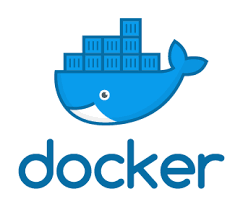

# Stability & Reliability

- Blog: [CloudNative Production Readiness Part 1](https://tejasc.com/cnpr-part1/)
- Sample App: [demo-go-postgres repo](https://github.com/rsmcode/demo-go-postgres)

The following cloud native tools helps implement:

- build and package in a standardized and automated fashion
- standardize development, testing and debugging cycles

## Prerequisite

```bash
make deps
```

> Only execute this command if you're on a mac and you have brew installed

The command will install the following tools:

- GolangCI-Lint
- Kind
- Skaffold
- KO
- Tanka
- Helm
- Pack
- ArgoCD
- Octant

## Application Containerization



### Docker

Docker is a software platform for building applications based on containers — small and lightweight execution environments that make shared use of the operating system kernel but otherwise run in isolation from one another. Utilises Dockerfile, context and Docker Daemon to build docker image.

| Open Source                         | Managed By | First Release |
| ----------------------------------- | ---------- | ------------- |
| [Repo](https://github.com/docker) ✅ | Docker     | 20 March 2013 |

```bash
make build.docker
```

The command builds a docker image using the instructions defined in the [Dockerfile](./Dockerfile). It creates a local image called `todo:docker`.

---


### Kaniko

kaniko is a tool to build container images from a Dockerfile, inside a container or Kubernetes cluster. kaniko doesn't require a Docker daemon and executes each commands in userspace. This enables building container images in environments that can't easily or securely run a Docker daemon.

| Open Source                                              | Managed By | First Release |
| -------------------------------------------------------- | ---------- | ------------- |
| [Repo](https://github.com/GoogleContainerTools/kaniko) ✅ | Google     | 18 May 2018   |

```bash
# Install and build image using kaniko
make build.kaniko
```

The command installs `kaniko` and builds a docker image using kaniko and the instructions defined in the [Dockerfile](./Dockerfile). Kaniko requires the executor container (gcr.io/kaniko-project/executor) to build the image. Images are built and pushed directly to gcr. It can cache image layers which can be useful to speed up build. Layers are cached by executing kaniko with the following flags: `--cache=true --cache-repo "${GCR_IMAGE}/cache"`.

---


### Buildpack

Buildpacks use auto-detection. It tests groups of buildpacks against your source code and the first group that fits your source code will become the selected set of buildpacks. Criteria is specific to each buildpack – for instance, an NPM buildpack looks for a package.json, and a Go buildpack looks for Go source files.

| Open Source                                  | Managed By | First Release |
| -------------------------------------------- | ---------- | ------------- |
| [Repo](https://github.com/buildpacks/pack) ✅ | CNCF       | 21 Aug 2018   |

```bash
# Install and build image using pack
make build.pack
```

The command install `pack` and uses Google Buildpack (gcr.io/buildpacks/builder:v1) to create a local docker image called `todo:pack`.

---


### KO

Ideal for use cases where your image contains a single Go application without any/many dependencies on the OS base image (e.g., no cgo, no OS package dependencies). ko builds images by effectively executing go build on your local machine, and as such doesn't require docker to be installed. ko does its job without requiring you to write a Dockerfile or even install Docker itself on your machine.

This is what ko does:
- Download a base image from a container registry
- Statically compile your Go binary
- Create a new container image layer with the Go binary
- Append that layer to the base image to create a new image
- Push the new image to the remote container registry

For a deeper comparision of KO and Buildpack, checkout the [Google Cloud Blog](https://cloud.google.com/blog/topics/developers-practitioners/ship-your-go-applications-faster-cloud-run-ko)

| Open Source                            | Managed By | First Release |
| -------------------------------------- | ---------- | ------------- |
| [Repo](https://github.com/google/ko) ✅ | Google     | 22 Mar 2019   |

```bash
make build.ko
```

The command installs `ko` and uses `ko` to create and push docker image to gcr registry.

---

## Local Testing


### KIND (Kubernetes in Docker)

kind is a tool for running local Kubernetes clusters using Docker container nodes. kind was primarily designed for testing Kubernetes itself, but may be used for local development or CI.

| Open Source                                       | Managed By | First Release |
| ------------------------------------------------- | ---------- | ------------- |
| [Repo](https://github.com/kubernetes-sigs/kind) ✅ | CNCF       | 29 Nov 2018   |

```bash
make cluster
```

The command installs `kind` and uses that to create a kubernetes cluster. Any images you want to deploy to kind needs to be manually loaded into kind using the following command: `kind load docker-image my-custom-image-0 my-custom-image-1`

---

## Manifest Packaging


### Helm

Helm uses charts, a collection of files that describe a related set of Kubernetes resources. A single chart might be used to deploy something simple, like a memcached pod, or something complex, like a full web app stack with HTTP servers, databases, caches, and so on. Charts are created as files laid out in a particular directory tree. They can be packaged into versioned archives to be deployed.

| Open Source                            | Managed By | First Release |
| -------------------------------------- | ---------- | ------------- |
| [Repo](https://github.com/helm/helm) ✅ | CNCF       | November 2015 |

```bash
make manifests.helm
```

The command installs `helm` and uses the [helm chart](./deploy/helm) to template files and outputs them [here](./deploy/output/helm.yaml). You can define default values in the [chart values](./deploy/helm/values.yaml) file and override values on per env basis which is defined in [config folder](./deploy/config/).

---


### Tanka

Grafana Tanka is a robust configuration utility for your Kubernetes cluster, powered by the unique Jsonnet language. Kubernetes Jsonnet library makes defining of Kubernetes resources more concise and clean than traditional YAML has ever been.

| Open Source                                | Managed By | First Release |
| ------------------------------------------ | ---------- | ------------- |
| [Repo](https://github.com/grafana/tanka) ✅ | Grafana    | 31 Jul 2019   |

```bash
make manifests.tanka
```

The command installs `tanka` and uses [jsonnet library](./deploy/tanka/lib/todo/) and [envrionments](./deploy/tanka/environments/) to template files and outputs them in [tanka folder](./deploy/output/tanka). Similar to helm, default values can be defined the app lib, while per env overrides can be defined in the environment dir using jsonnet language.

---


### KO

"ko resolve" and "ko apply" commands you can hydrate your YAML manifests as ko replaces your "image:" references in YAML automatically with the image it builds, so you can deploy the resulting YAML to the Kubernetes cluster with kubectl:

| Open Source                            | Managed By | First Release |
| -------------------------------------- | ---------- | ------------- |
| [Repo](https://github.com/google/ko) ✅ | Google     | 22 Mar 2019   |

```bash
# Install and template manifests using ko
make manifests.ko
```

`ko` consumes [fully baked manifests](./deploy/ko/deploy.yaml) and allows you to dynamically replace the deployment image with the exact version of image build by ko. It does this by using the following template string: `ko://01-stability-reliability/cmd/todo` where `01-stability-reliability/cmd/todo` is a go cmd path.

---

## Devex


### Skaffold

Skaffold is a command line tool that facilitates continuous development for Kubernetes-native applications. Skaffold handles the workflow for building, pushing, and deploying your application, and provides building blocks for creating CI/CD pipelines. This enables you to focus on iterating on your application locally while Skaffold continuously deploys to your local or remote Kubernetes cluster.

| Open Source                                                | Managed By | First Release |
| ---------------------------------------------------------- | ---------- | ------------- |
| [Repo](https://github.com/GoogleContainerTools/skaffold) ✅ | Google     | 6 Mar 2018    |

```bash
make dev
```

Skaffold consumes a [skaffold.yaml](./skaffold.yaml) to define image building, tagging and deployment steps, allowing app devs to get the application up and running in a kubernetes cluster by cloning the repo and executing `skaffold dev`. Assuming you have a kube cluster running, `make dev` will:

- Install skaffold
- Create 3 namespaces
- Helm template manifests
- Create a psql DB
- Build a docker image
- Deploy the image
- Port forward to the container
- Hot reload on file changes

---


### Octant

Octant is a tool for developers to understand how applications run on a Kubernetes cluster. It aims to be part of the developer's toolkit for gaining insight and approaching complexity found in Kubernetes. Octant offers a combination of introspective tooling, cluster navigation, and object management along with a plugin system to further extend its capabilities.

| Open Source                                      | Managed By | First Release |
| ------------------------------------------------ | ---------- | ------------- |
| [Repo](https://github.com/vmware-tanzu/octant) ✅ | VMware     | 20 Nov 2018   |

```bash
# Install and open octant UI
make ui
```

`make ui` installs octant and runs it which discovers kube resources installed in your kube cluster and outputs them in a localhost website, usually `http://127.0.0.1:7777/`.

---

## Deploy


### ArgoCD

Argo CD is a declarative, GitOps continuous delivery tool for Kubernetes. Argo CD follows the GitOps pattern of using Git repositories as the source of truth for defining the desired application state. Application definitions, configurations, and environments should be declarative and version controlled. Application deployment and lifecycle management should be automated, auditable, and easy to understand.

| Open Source                                   | Managed By | First Release |
| --------------------------------------------- | ---------- | ------------- |
| [Repo](https://github.com/argoproj/argo-cd) ✅ | CNCF       | 13 Mar 2018   |

```bash
make argo.setup
make argo
```

Getting argo up and running to split into 2 commands:

- `make argo.setup`: Creates `argocd` namespaces and deploys ArgoCD and ApplicationSet controllers. ArgoCD by itself is only capable of managing 1 application in 1 environment. ApplicationSet is a controller which consumes an `ApplicationSet` CRD which enables devs to define manifest for an application deployed into multiple env / namespaces.
- You'll need to manually setup `argocd` CLI before executing the next step. You can find more information [here](https://argoproj.github.io/argo-cd/getting_started/#4-login-using-the-cli).
- `make argo`: Deploy the `ApplicationSet` CRD and syncs the state of the cluster with the config defined in git. It syncs the state of resources with the files defined in [manifests folder](./deploy/manifests/)

---
